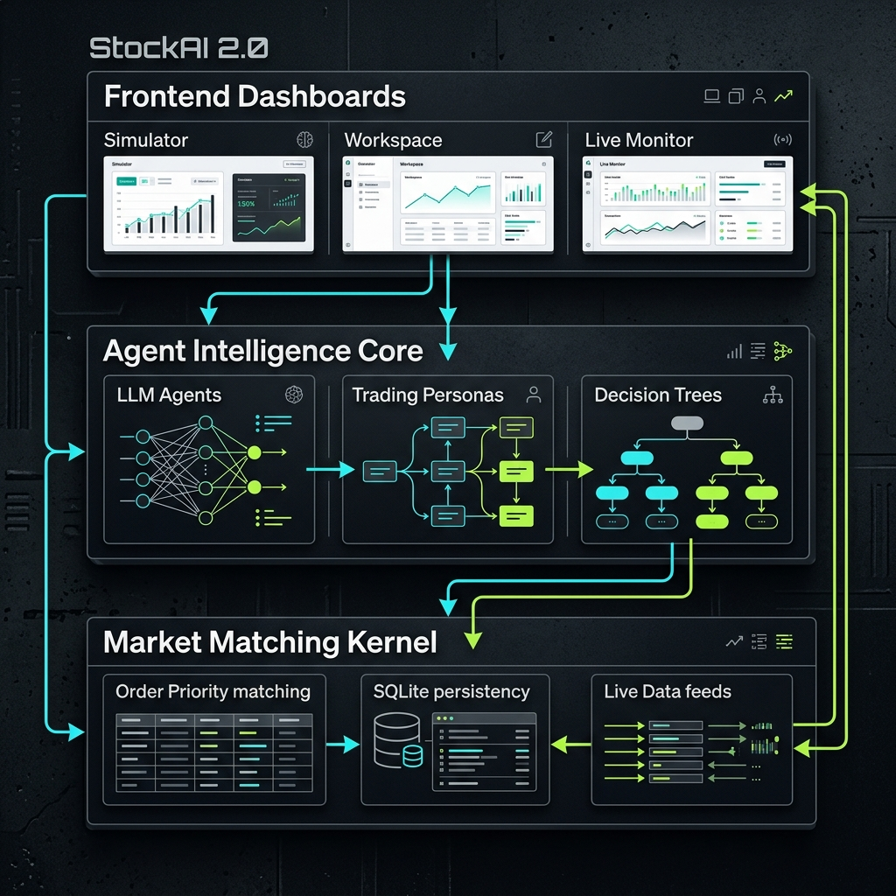
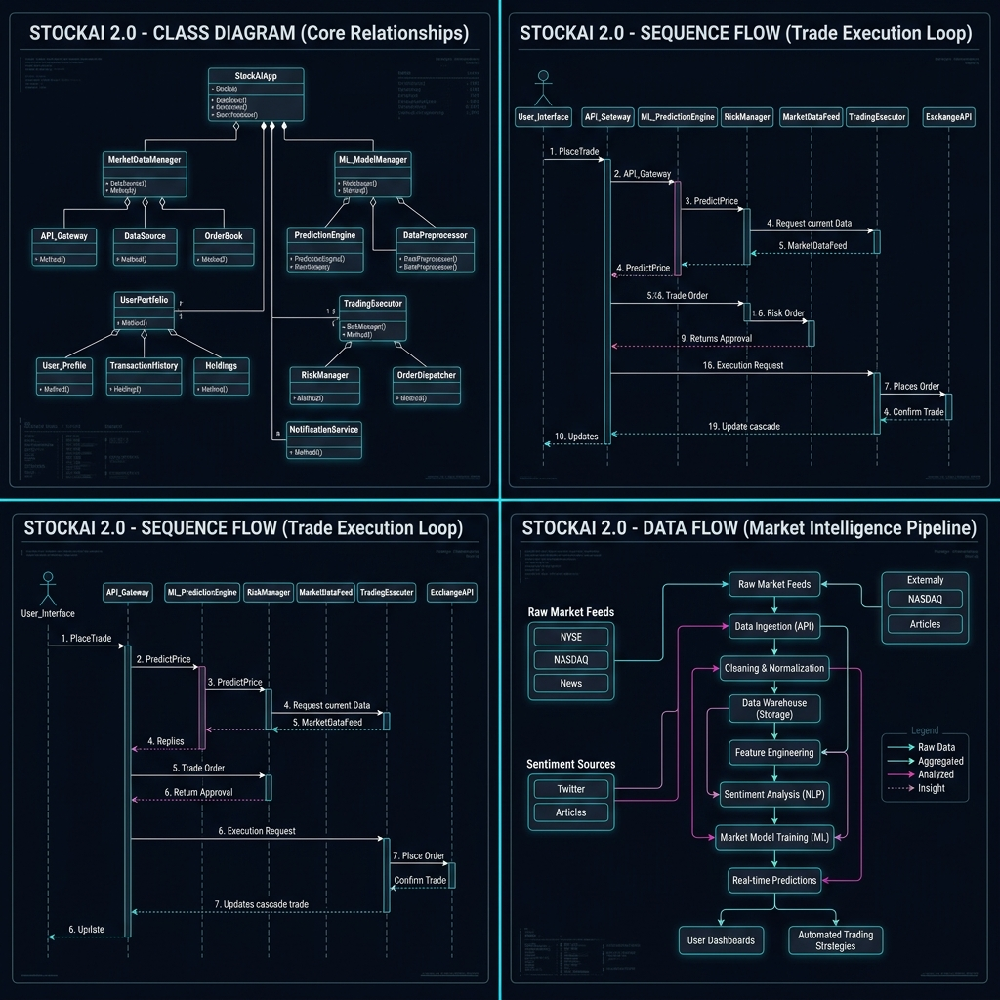
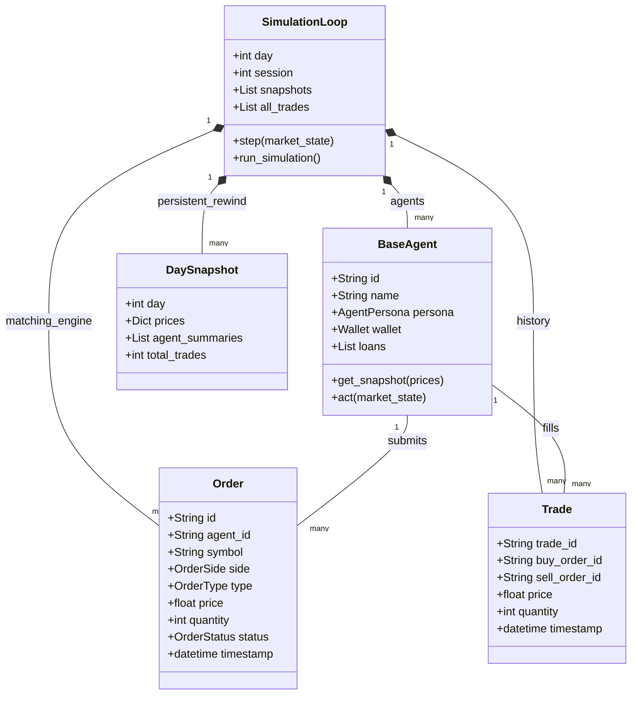
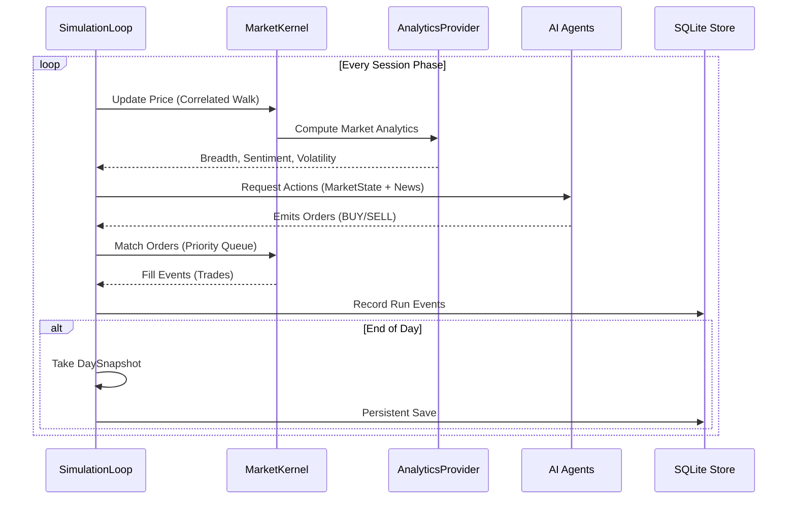
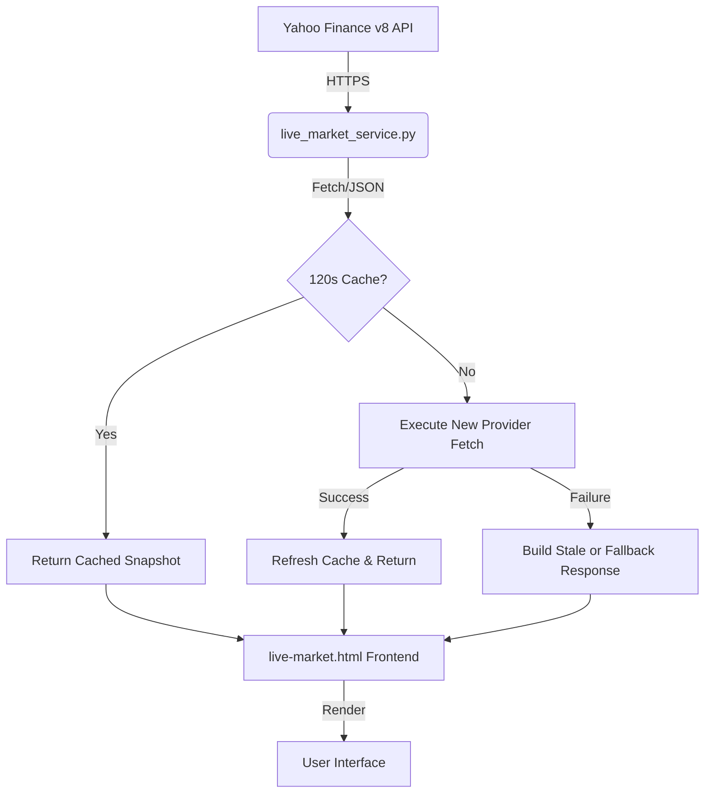
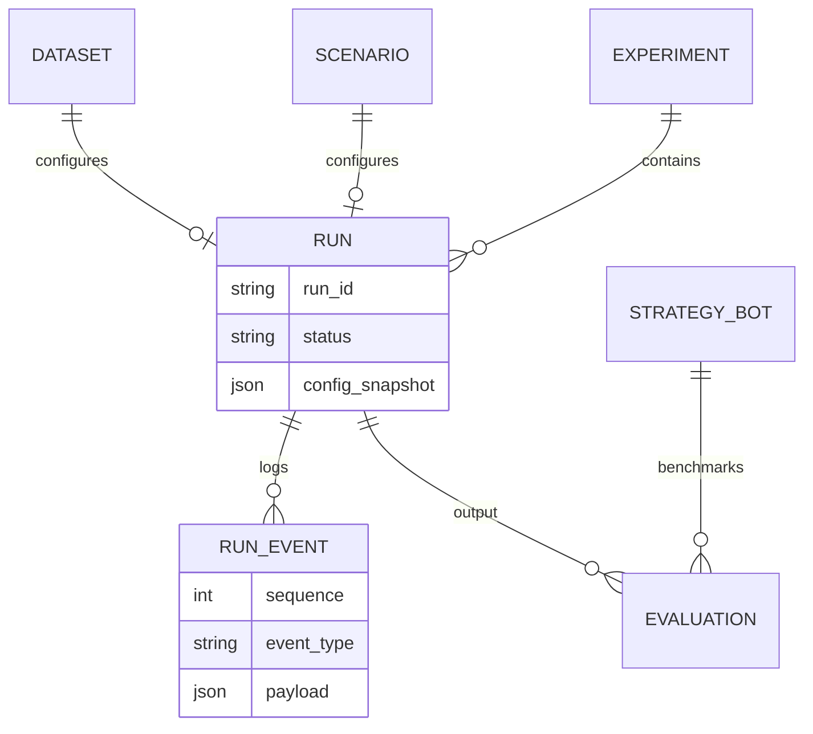

## 1. High-Level Architecture (V2)
The following descriptive diagram illustrates the architectural layers of StockAI 2.0.

---

## 2. UML Diagram Suite
A comprehensive visual suite of the project's core logic and data flow.

---

## 3. Mermaid Source Diagrams
The following sections provide the live Mermaid code for maintenance and expansion.

### 2.1 Class Diagram (Core Data Models)
This diagram shows the relationships between orders, trades, agents, and simulation snapshots.

### 2.2 Sequence Diagram (Simulation Step Lifecycle)
This diagram illustrates the flow of data during a single simulation step.

### 2.3 Data Flow Diagram (Market Intelligence)
How live market data reaches the Performance Monitor.

### 2.4 Entity-Relationship (E-R) Diagram
The layout of the persistent research store.

